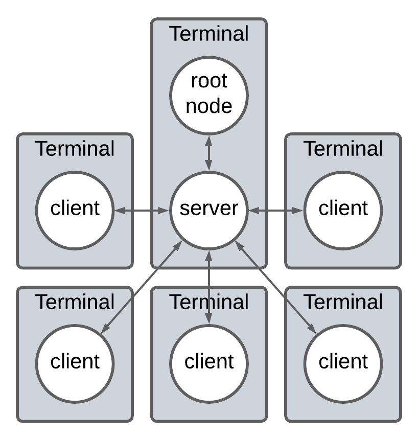

# CoupBots
Crazy attempt to have bots play coup together

## Objective
This project serves as a programming championship to determine which bot is the best overall. The winning bot must win, on average, more games than the rest of the bots.

## Game Rules
The original rules of Coup can be read [here](https://www.qugs.org/rules/r131357.pdf).

## Network arrangement
Each game of Coup is simulated and played using a **Server**, a **Root Node** and 2-5 **Clients**. The connections between these hodes are as follows:

### Server
The **Server** is responsible for routing the messages between each **Client** and the **Root Node**.

### Client
The **Clients** are the instances that run the game's players. The purpose of this project is to implement several instances of a bot player, each one running on a different **Client**.

### Root Node
The **Root Node** is the central node that holds the game state and is responsible for updating the game state based on the actions taken by the **Clients**. This node validates each **Client**'s move according to the possible moves and replies messages to be broadcasted or addressed to a specific **Client**. The **Root Node** is, to the **Server**, also seen as a **Client** but since it's always the first one to connect, its ID is always 0.

### Communication
Each message sent by a **Client** is always routed to the **Root Node**. The **Root Node** then decides whether to invalidate the message, to broadcast it to the other **Clients** or to simply update the game state.

### Instancing
To instanciate the **Root Node** and the **Server**, run `python src/run_server.py`. This will start the server and spawn an instance of the **Root Node** that connects automatically to the **Server** using the same address and port.

To instanciate one **Client** as a player, there are 2 options:
- run `python src/run_bot.py` to connect to the **Server** as a bot.
- run `python src/run_human.py` to connect to the **Server** as a human. This allows to test sending commands manually.

Each instance must run on a separate terminal, but not necessarily on the same machine. As long as the connection address and port matches the **Server**, **Clients** can connect from different machines.
